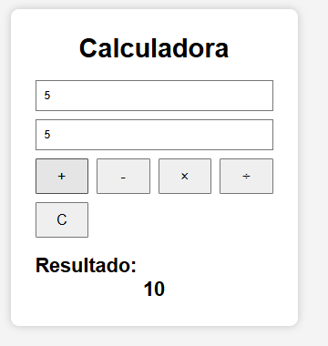
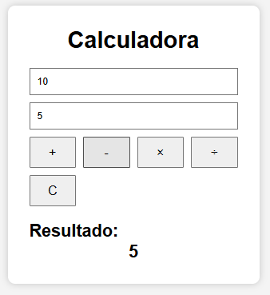
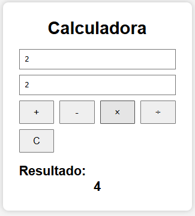
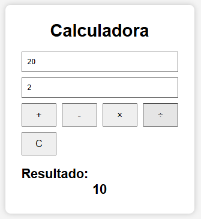

**Soma**

Foi criado um botão para a operação de soma. Utilizando o método addEventListener, foi adicionado um evento de clique nesse botão. Quando o usuário clica, o JavaScript captura os valores dos dois campos através do getElementById, converte os valores para número utilizando Number() e realiza a operação de adição. O resultado é exibido utilizando innerHTML.

**Subtração**

A implementação da subtração segue a mesma lógica da soma. Ao clicar no botão de subtração, os valores informados são capturados, convertidos para número e subtraídos. O resultado é atualizado na área destinada à exibição dos cálculos.

**Multiplicação**

Para a multiplicação, foi criado um botão específico com um evento de clique. Quando acionado, o JavaScript obtém os valores digitados pelo usuário, realiza a multiplicação e apresenta o resultado na tela.

**Divisão**

A divisão também foi implementada através de um evento de clique. Os valores informados são capturados e utilizados na operação de divisão. Além disso, foi criada uma validação para verificar se o segundo número é igual a zero. Caso isso aconteça, uma mensagem é exibida informando que não é possível realizar a divisão por zero.
